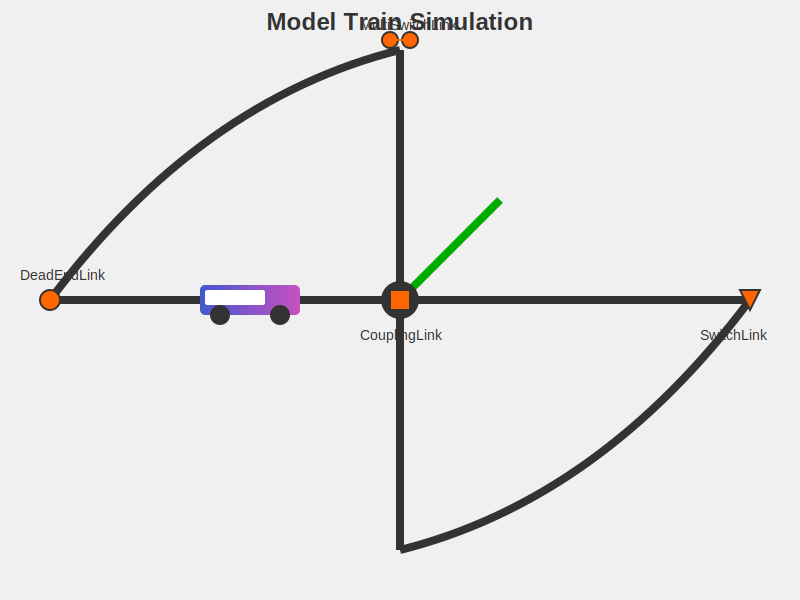

# Model Train Simulation



## Description

Model Train Simulation is a Java-based project that simulates a model train system. It features a variety of track layouts, different types of links between track segments, and a graphical user interface to visualize the train's movement. This project demonstrates advanced object-oriented programming concepts, including inheritance, interfaces, and graphical user interface development.

## Features

- Multiple types of track links (e.g., DeadEndLink, CouplingLink, SwitchLink, MultiSwitchLink)
- Customizable track layouts
- Real-time train movement simulation
- Graphical user interface for visualization
- Expandable architecture for adding new track types and features

## Project Structure

The project is organized into several packages:

### hw4 Package (Core Game Logic)

- `AbstractLink`: Base class for all link types
- `CouplingLink`: Connects two points directly
- `DeadEndLink`: Represents a dead end in the track
- `MultiFixedLink`: Represents a link with multiple fixed point pairs
- `MultiSwitchLink`: Represents a link with multiple switchable point pairs
- `StraightLink`: Represents a straight connection between three points
- `SwitchLink`: Represents a switch that can connect a point to either of two other points
- `TurnLink`: Represents a fixed link with three paths in a turn configuration

### api Package (Interfaces and Utility Classes)

- `Crossable`: Interface for objects that can be crossed
- `Traversable`: Interface for objects that can be traversed
- `Point`: Represents a point on the track
- `PositionVector`: Represents the train's position
- `Train`: Represents the train object

### simulation Package (Simulation Logic)

- `Simulation`: Main simulation logic
- `Track`: Represents the entire track layout
- `TestTrack1` and `TestTrack2`: Sample track layouts
- `PathTypes`: Defines various path types for track segments

### ui Package (User Interface Components)

- `SimMain`: Main class to run the simulation with GUI
- `SimulationPanel`: Main panel containing the simulation view and controls
- `TracksPanel`: Panel for rendering the tracks and train

## How to Run

1. Compile the project ensuring all dependencies are met.
2. Run the `SimMain` class in the `ui` package.
3. Use the GUI to select different track layouts and observe the train's movement.

## Usage

To create a custom track layout:

```java
public class CustomTrack extends Track {
    public CustomTrack() {
        Path path1 = addPathType(PathTypes.pathType5, 5, 5, WEST, EAST);
        Path path2 = addPathType(PathTypes.pathType1, 6, 5, WEST, NORTH);
        Crossable link = new CouplingLink(path1.getHighpoint(), path2.getLowpoint());
        path1.setHighEndpointLink(link);
        path2.setLowEndpointLink(link);
        // Add more paths and links as needed
    }
}
```

To run a simulation with a custom track:

```java
Simulation simulation = new Simulation();
simulation.setTrack(new CustomTrack());
SimulationPanel simulationPanel = new SimulationPanel(simulation);
// Add simulationPanel to your GUI
```

## Future Improvements

- Add more complex track layouts and obstacles
- Implement multiple trains with collision detection
- Add sound effects for a more immersive experience
- Create a track editor for users to design custom layouts
- Implement different train types with varying speeds and capabilities

## Author

Abhay Prasanna Rao
